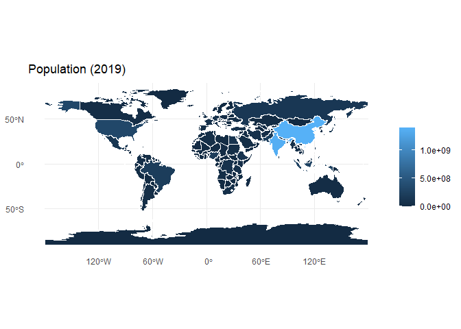
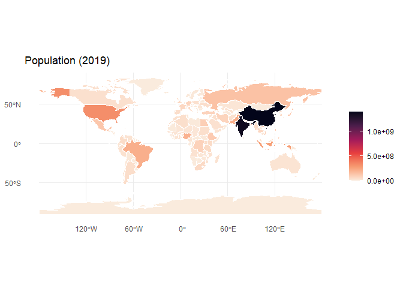
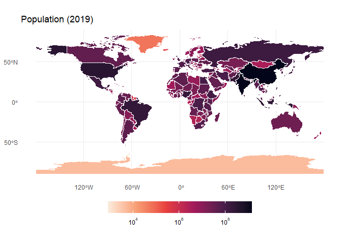
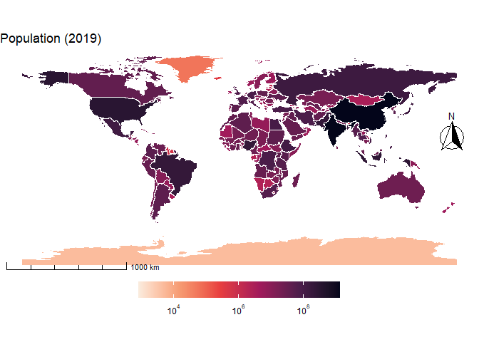
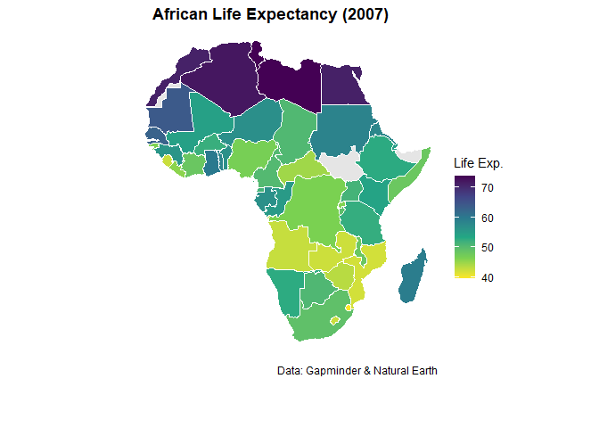

Chap04 - Thematic map
================

``` r
pacman::p_load(
    rio,            # import and export files
    here,           # locate files 
    tidyverse,      # data management and visualization
    rnaturalearth,
    rnaturalearthdata,
    sf,
    ggspatial,      # add Scale bars/North arrows
    gapminder,
    countrycode
)
```

# Basic choropleth map

``` r
# basic choropleth map #-------------
```

## Data

``` r
## data #-----------
world_countries <- rnaturalearth::ne_countries(scale = 'medium',
                                               returnclass = 'sf') %>% 
    tibble()

names(world_countries)
```

    ##   [1] "featurecla" "scalerank"  "labelrank"  "sovereignt" "sov_a3"     "adm0_dif"   "level"     
    ##   [8] "type"       "tlc"        "admin"      "adm0_a3"    "geou_dif"   "geounit"    "gu_a3"     
    ##  [15] "su_dif"     "subunit"    "su_a3"      "brk_diff"   "name"       "name_long"  "brk_a3"    
    ##  [22] "brk_name"   "brk_group"  "abbrev"     "postal"     "formal_en"  "formal_fr"  "name_ciawf"
    ##  [29] "note_adm0"  "note_brk"   "name_sort"  "name_alt"   "mapcolor7"  "mapcolor8"  "mapcolor9" 
    ##  [36] "mapcolor13" "pop_est"    "pop_rank"   "pop_year"   "gdp_md"     "gdp_year"   "economy"   
    ##  [43] "income_grp" "fips_10"    "iso_a2"     "iso_a2_eh"  "iso_a3"     "iso_a3_eh"  "iso_n3"    
    ##  [50] "iso_n3_eh"  "un_a3"      "wb_a2"      "wb_a3"      "woe_id"     "woe_id_eh"  "woe_note"  
    ##  [57] "adm0_iso"   "adm0_diff"  "adm0_tlc"   "adm0_a3_us" "adm0_a3_fr" "adm0_a3_ru" "adm0_a3_es"
    ##  [64] "adm0_a3_cn" "adm0_a3_tw" "adm0_a3_in" "adm0_a3_np" "adm0_a3_pk" "adm0_a3_de" "adm0_a3_gb"
    ##  [71] "adm0_a3_br" "adm0_a3_il" "adm0_a3_ps" "adm0_a3_sa" "adm0_a3_eg" "adm0_a3_ma" "adm0_a3_pt"
    ##  [78] "adm0_a3_ar" "adm0_a3_jp" "adm0_a3_ko" "adm0_a3_vn" "adm0_a3_tr" "adm0_a3_id" "adm0_a3_pl"
    ##  [85] "adm0_a3_gr" "adm0_a3_it" "adm0_a3_nl" "adm0_a3_se" "adm0_a3_bd" "adm0_a3_ua" "adm0_a3_un"
    ##  [92] "adm0_a3_wb" "continent"  "region_un"  "subregion"  "region_wb"  "name_len"   "long_len"  
    ##  [99] "abbrev_len" "tiny"       "homepart"   "min_zoom"   "min_label"  "max_label"  "label_x"   
    ## [106] "label_y"    "ne_id"      "wikidataid" "name_ar"    "name_bn"    "name_de"    "name_en"   
    ## [113] "name_es"    "name_fa"    "name_fr"    "name_el"    "name_he"    "name_hi"    "name_hu"   
    ## [120] "name_id"    "name_it"    "name_ja"    "name_ko"    "name_nl"    "name_pl"    "name_pt"   
    ## [127] "name_ru"    "name_sv"    "name_tr"    "name_uk"    "name_ur"    "name_vi"    "name_zh"   
    ## [134] "name_zht"   "fclass_iso" "tlc_diff"   "fclass_tlc" "fclass_us"  "fclass_fr"  "fclass_ru" 
    ## [141] "fclass_es"  "fclass_cn"  "fclass_tw"  "fclass_in"  "fclass_np"  "fclass_pk"  "fclass_de" 
    ## [148] "fclass_gb"  "fclass_br"  "fclass_il"  "fclass_ps"  "fclass_sa"  "fclass_eg"  "fclass_ma" 
    ## [155] "fclass_pt"  "fclass_ar"  "fclass_jp"  "fclass_ko"  "fclass_vn"  "fclass_tr"  "fclass_id" 
    ## [162] "fclass_pl"  "fclass_gr"  "fclass_it"  "fclass_nl"  "fclass_se"  "fclass_bd"  "fclass_ua" 
    ## [169] "geometry"

``` r
(wdf_plot <- world_countries %>% 
        select(admin, pop_year, pop_est, geometry) %>% 
        st_as_sf(crs = st_crs(4326)))
```

    ## Simple feature collection with 242 features and 3 fields
    ## Geometry type: MULTIPOLYGON
    ## Dimension:     XY
    ## Bounding box:  xmin: -180 ymin: -89.99893 xmax: 180 ymax: 83.59961
    ## Geodetic CRS:  WGS 84
    ## # A tibble: 242 × 4
    ##    admin                          pop_year  pop_est                                      geometry
    ##  * <chr>                             <int>    <dbl>                            <MULTIPOLYGON [°]>
    ##  1 Zimbabwe                           2019 14645468 (((31.28789 -22.40205, 31.19727 -22.34492, 3…
    ##  2 Zambia                             2019 17861030 (((30.39609 -15.64307, 30.25068 -15.64346, 2…
    ##  3 Yemen                              2019 29161922 (((53.08564 16.64839, 52.58145 16.47036, 52.…
    ##  4 Vietnam                            2019 96462106 (((104.064 10.39082, 104.083 10.34111, 104.0…
    ##  5 Venezuela                          2019 28515829 (((-60.82119 9.138379, -60.94141 9.105566, -…
    ##  6 Vatican                            2019      825 (((12.43916 41.89839, 12.43057 41.89756, 12.…
    ##  7 Vanuatu                            2019   299882 (((166.7458 -14.82686, 166.8102 -15.15742, 1…
    ##  8 Uzbekistan                         2019 33580650 (((70.94678 42.24868, 70.979 42.26655, 71.03…
    ##  9 Uruguay                            2019  3461734 (((-53.37061 -33.74219, -53.41958 -33.7792, …
    ## 10 Federated States of Micronesia     2019   113815 (((162.9832 5.325732, 162.9935 5.277246, 162…
    ## # ℹ 232 more rows

``` r
wdf_plot %>% count(pop_year)
```

    ## Simple feature collection with 8 features and 2 fields
    ## Geometry type: GEOMETRY
    ## Dimension:     XY
    ## Bounding box:  xmin: -180 ymin: -89.99893 xmax: 180 ymax: 83.59961
    ## Geodetic CRS:  WGS 84
    ## # A tibble: 8 × 3
    ##   pop_year     n                                                                         geometry
    ## *    <int> <int>                                                                   <GEOMETRY [°]>
    ## 1     2011     1 POLYGON ((167.9206 -29.01396, 167.9062 -29.02812, 167.9186 -29.0251, 167.9246 -…
    ## 2     2013     1 POLYGON ((77.16855 35.17153, 77.29297 35.23555, 77.42344 35.30259, 77.57158 35.…
    ## 3     2014     1 POLYGON ((48.90313 11.25488, 48.67441 11.32266, 48.57256 11.32051, 48.43887 11.…
    ## 4     2016     5 MULTIPOLYGON (((105.7055 -10.43066, 105.6698 -10.44941, 105.6455 -10.45225, 105…
    ## 5     2017     6 MULTIPOLYGON (((69.05215 -49.08193, 69.03271 -49.01758, 69.09941 -48.9376, 69.1…
    ## 6     2018     4 MULTIPOLYGON (((-169.7934 -19.04258, -169.834 -18.96602, -169.8616 -18.96865, -…
    ## 7     2019   222 MULTIPOLYGON (((50.61748 26.00234, 50.60977 26.12446, 50.55781 26.19829, 50.585…
    ## 8     2020     2 MULTIPOLYGON (((121.1612 22.77637, 121.2959 22.9666, 121.3522 23.06729, 121.397…

## Plot

``` r
## plot #---------------------------
```

Basic map

``` r
fig_basis <- wdf_plot %>% 
    filter(pop_year == 2019) %>% 
    ggplot() +
    geom_sf(aes(geometry = geometry,
                fill = pop_est),
            color = "white",
            linewidth = 0.1) +
    labs(title = "Population (2019)",
         fill = NULL) + 
    theme_minimal()

fig_basis
```

<!-- -->

Customize colors

``` r
fig_basis +
    scale_fill_viridis_c(option = "rocket",
                         # reverse palette
                         direction = -1,
                         # color for missing values
                         na.value = "grey80")
```

<!-- -->

``` r
fig1 <- fig_basis +
    scale_fill_viridis_c(option = "rocket",
                         # reverse palette
                         direction = -1,
                         # color for missing values
                         na.value = "grey80",
                         # log10 transformation
                         trans = "log10",
                         # labels for log scale
                         labels = scales::label_log(digits = 2)) +
    theme(legend.position = "bottom",
          legend.key.width = grid::unit(1.5, "cm"))

fig1
```

    ## Warning in scale_fill_viridis_c(option = "rocket", direction = -1, na.value = "grey80", : log-10
    ## transformation introduced infinite values.

<!-- -->

Adding map elements

``` r
fig2 <- fig1 +
    # add scale bar
    ggspatial::annotation_scale(location = "bl",
                                width_hint = 0.3,
                                style = "ticks") +
    # add north arrow
    ggspatial::annotation_north_arrow(location = "tr",
                                      which_north = "true",
                                      pad_x = unit(0.1, "in"),
                                      pad_y = unit(1, "in"),
                                      style = ggspatial::north_arrow_fancy_orienteering) +
    theme_void() +
    theme(legend.position = "bottom",
          legend.key.width = grid::unit(1.5, "cm"))

fig2
```

    ## Warning in scale_fill_viridis_c(option = "rocket", direction = -1, na.value = "grey80", : log-10
    ## transformation introduced infinite values.

    ## Scale on map varies by more than 10%, scale bar may be inaccurate

<!-- -->

# Mapping African Indicators

``` r
# african indicators #--------------------
```

## Prepare data

``` r
## prepare data #--------------------------
```

Get African country polygons

``` r
(africa_sf <- rnaturalearth::ne_countries(scale = "medium",
                                         continent = "Africa",
                                         returnclass = "sf") %>% 
    dplyr::select(iso_a3 = adm0_a3, name, geometry))
```

    ## Simple feature collection with 54 features and 2 fields
    ## Geometry type: MULTIPOLYGON
    ## Dimension:     XY
    ## Bounding box:  xmin: -25.34155 ymin: -46.96289 xmax: 51.39023 ymax: 37.34038
    ## Geodetic CRS:  WGS 84
    ## First 10 features:
    ##    iso_a3         name                       geometry
    ## 1     ZWE     Zimbabwe MULTIPOLYGON (((31.28789 -2...
    ## 2     ZMB       Zambia MULTIPOLYGON (((30.39609 -1...
    ## 35    UGA       Uganda MULTIPOLYGON (((33.90322 -1...
    ## 38    TUN      Tunisia MULTIPOLYGON (((11.50459 33...
    ## 41    TGO         Togo MULTIPOLYGON (((0.9004883 1...
    ## 44    TZA     Tanzania MULTIPOLYGON (((39.49648 -6...
    ## 50    SWZ     eSwatini MULTIPOLYGON (((31.94824 -2...
    ## 52    SDS     S. Sudan MULTIPOLYGON (((33.97607 4....
    ## 53    SDN        Sudan MULTIPOLYGON (((34.07812 9....
    ## 57    ZAF South Africa MULTIPOLYGON (((29.36484 -2...

Filter `gapminder` for latest year

``` r
(gapminder_latest <- gapminder %>% 
    slice_max(year) %>% 
    select(country, lifeExp))
```

    ## # A tibble: 142 × 2
    ##    country     lifeExp
    ##    <fct>         <dbl>
    ##  1 Afghanistan    43.8
    ##  2 Albania        76.4
    ##  3 Algeria        72.3
    ##  4 Angola         42.7
    ##  5 Argentina      75.3
    ##  6 Australia      81.2
    ##  7 Austria        79.8
    ##  8 Bahrain        75.6
    ##  9 Bangladesh     64.1
    ## 10 Belgium        79.4
    ## # ℹ 132 more rows

Add iso_a3 codes to gapminder_latest

``` r
gapminder_latest %>% 
    mutate(iso_a3 = countrycode::countrycode(country,
                                             origin = 'country.name',
                                             destination = 'iso3c'))
```

    ## # A tibble: 142 × 3
    ##    country     lifeExp iso_a3
    ##    <fct>         <dbl> <chr> 
    ##  1 Afghanistan    43.8 AFG   
    ##  2 Albania        76.4 ALB   
    ##  3 Algeria        72.3 DZA   
    ##  4 Angola         42.7 AGO   
    ##  5 Argentina      75.3 ARG   
    ##  6 Australia      81.2 AUS   
    ##  7 Austria        79.8 AUT   
    ##  8 Bahrain        75.6 BHR   
    ##  9 Bangladesh     64.1 BGD   
    ## 10 Belgium        79.4 BEL   
    ## # ℹ 132 more rows

Add life expectancy to polygons

``` r
(wdf_africa <- gapminder_latest %>% 
    mutate(iso_a3 = countrycode::countrycode(country,
                                             origin = 'country.name',
                                             destination = 'iso3c')) %>% 
    right_join(africa_sf,
               by = join_by(iso_a3)) %>% 
    select(iso_a3, lifeExp, country, name, geometry))
```

    ## # A tibble: 54 × 5
    ##    iso_a3 lifeExp country                  name                                          geometry
    ##    <chr>    <dbl> <fct>                    <chr>                               <MULTIPOLYGON [°]>
    ##  1 DZA       72.3 Algeria                  Algeria              (((8.576563 36.93721, 8.597656 3…
    ##  2 AGO       42.7 Angola                   Angola               (((13.07275 -4.634766, 13.05732 …
    ##  3 BEN       56.7 Benin                    Benin                (((1.622656 6.216797, 1.610938 6…
    ##  4 BWA       50.7 Botswana                 Botswana             (((25.25879 -17.79355, 25.23906 …
    ##  5 BFA       52.3 Burkina Faso             Burkina Faso         (((0.9004883 10.99326, 0.6429688…
    ##  6 BDI       49.6 Burundi                  Burundi              (((30.55361 -2.400098, 30.53369 …
    ##  7 CMR       50.4 Cameroon                 Cameroon             (((8.555859 4.755225, 8.585156 4…
    ##  8 CAF       44.7 Central African Republic Central African Rep. (((24.14736 8.665625, 24.19482 8…
    ##  9 TCD       50.7 Chad                     Chad                 (((23.98027 19.49663, 23.98066 1…
    ## 10 COM       65.2 Comoros                  Comoros              (((44.47637 -12.08154, 44.52676 …
    ## # ℹ 44 more rows

## Plot

``` r
## plot #--------------------------
wdf_africa %>%
    ggplot() +
    geom_sf(aes(geometry = geometry,
                fill = lifeExp),
            color = "white",
            linewidth = 0.1) +
    scale_fill_viridis_c(option = "viridis",
                         direction = -1,
                         name = "Life Exp.",
                         na.value = "grey90") +
    labs(title = paste("African Life Expectancy (2007)"),
         caption = "Data: Gapminder & Natural Earth") +
    theme_void() +
    theme(legend.position.inside = c(0.15, 0.8),
          plot.title = element_text(hjust = 0.5, face = "bold"),
          plot.caption = element_text(hjust = 0.95, vjust = 30))
```

<!-- -->
