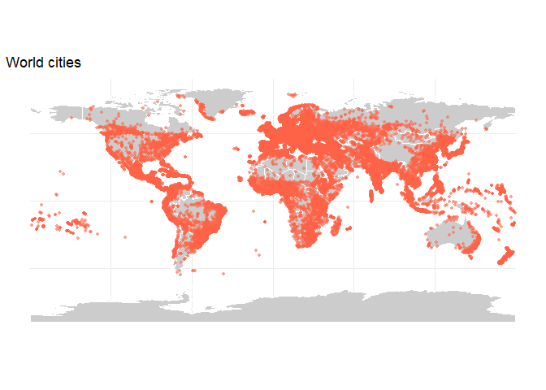
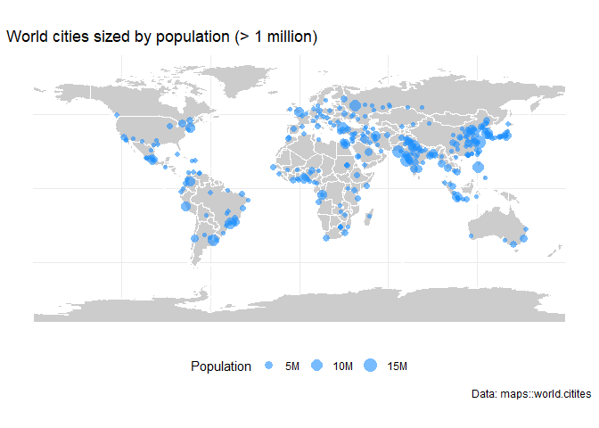
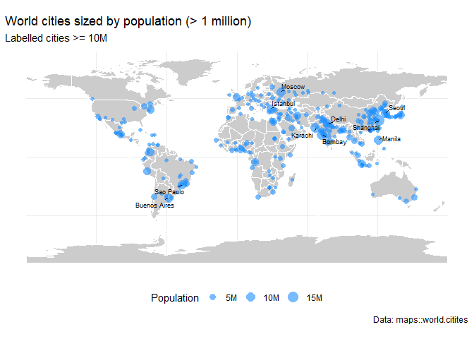

Chap05 - Points map
================

``` r
pacman::p_load(
    rio,            # import and export files
    here,           # locate files 
    tidyverse,      # data management and visualization
    rnaturalearth,
    sf,
    maps,            # for simple city data
    ggrepel         # labeling
)
```

# Basic map

``` r
# basic map #-------------
```

## Data

``` r
## data #-----------
```

Get world boundaries for background map

``` r
(world_map_background <- rnaturalearth::ne_countries(scale = 'medium',
                                                    returnclass = 'sf') %>% 
    dplyr::select(iso_a2, name, geometry))
```

    ## Simple feature collection with 242 features and 2 fields
    ## Geometry type: MULTIPOLYGON
    ## Dimension:     XY
    ## Bounding box:  xmin: -180 ymin: -89.99893 xmax: 180 ymax: 83.59961
    ## Geodetic CRS:  WGS 84
    ## First 10 features:
    ##    iso_a2       name                       geometry
    ## 1      ZW   Zimbabwe MULTIPOLYGON (((31.28789 -2...
    ## 2      ZM     Zambia MULTIPOLYGON (((30.39609 -1...
    ## 3      YE      Yemen MULTIPOLYGON (((53.08564 16...
    ## 4      VN    Vietnam MULTIPOLYGON (((104.064 10....
    ## 5      VE  Venezuela MULTIPOLYGON (((-60.82119 9...
    ## 6      VA    Vatican MULTIPOLYGON (((12.43916 41...
    ## 7      VU    Vanuatu MULTIPOLYGON (((166.7458 -1...
    ## 8      UZ Uzbekistan MULTIPOLYGON (((70.94678 42...
    ## 9      UY    Uruguay MULTIPOLYGON (((-53.37061 -...
    ## 10     FM Micronesia MULTIPOLYGON (((162.9832 5....

Get world city data: `maps::world.cities` is smaller than
`rnaturalearth` cities

``` r
maps::world.cities %>% tibble()
```

    ## # A tibble: 43,645 × 6
    ##    name               country.etc    pop   lat  long capital
    ##    <chr>              <chr>        <int> <dbl> <dbl>   <int>
    ##  1 'Abasan al-Jadidah Palestine     5629 31.3   34.3       0
    ##  2 'Abasan al-Kabirah Palestine    18999 31.3   34.4       0
    ##  3 'Abdul Hakim       Pakistan     47788 30.6   72.1       0
    ##  4 'Abdullah-as-Salam Kuwait       21817 29.4   48.0       0
    ##  5 'Abud              Palestine     2456 32.0   35.1       0
    ##  6 'Abwein            Palestine     3434 32.0   35.2       0
    ##  7 'Adadlay           Somalia       9198  9.77  44.6       0
    ##  8 'Adale             Somalia       5492  2.75  46.3       0
    ##  9 'Afak              Iraq         22706 32.1   45.3       0
    ## 10 'Afif              Saudi Arabia 41731 23.9   42.9       0
    ## # ℹ 43,635 more rows

``` r
(cities_df <- maps::world.cities %>% 
    dplyr::select(name, country.etc, pop, lat, long) %>% 
    st_as_sf(coords = c("long", "lat"),
             crs = 4326))
```

    ## Simple feature collection with 43645 features and 3 fields
    ## Geometry type: POINT
    ## Dimension:     XY
    ## Bounding box:  xmin: -178.8 ymin: -54.79 xmax: 179.81 ymax: 78.93
    ## Geodetic CRS:  WGS 84
    ## First 10 features:
    ##                  name  country.etc   pop            geometry
    ## 1  'Abasan al-Jadidah    Palestine  5629 POINT (34.34 31.31)
    ## 2  'Abasan al-Kabirah    Palestine 18999 POINT (34.35 31.32)
    ## 3        'Abdul Hakim     Pakistan 47788 POINT (72.11 30.55)
    ## 4  'Abdullah-as-Salam       Kuwait 21817 POINT (47.98 29.36)
    ## 5               'Abud    Palestine  2456 POINT (35.07 32.03)
    ## 6             'Abwein    Palestine  3434  POINT (35.2 32.03)
    ## 7            'Adadlay      Somalia  9198  POINT (44.65 9.77)
    ## 8              'Adale      Somalia  5492   POINT (46.3 2.75)
    ## 9               'Afak         Iraq 22706 POINT (45.26 32.07)
    ## 10              'Afif Saudi Arabia 41731 POINT (42.93 23.92)

## Simple dot map

``` r
## simple dot map #-----------------------
fig1 <- ggplot() +
    # world map background
    geom_sf(data = world_map_background,
            aes(geometry = geometry),
            fill = "grey80",
            color = "white",
            linewidth = 0.1) +
    # city points
    geom_sf(data = cities_df,
            aes(geometry = geometry),
            color = "tomato",
            size = 1,
            shape = 16,
            alpha = 0.6) +
    labs(title = "World cities") +
    theme_minimal() +
    theme(axis.text = element_blank())

fig1
```

<!-- -->

## Bubble map

``` r
## bubble map #-----------------------
fig2 <- ggplot() +
    # world map background
    geom_sf(data = world_map_background,
            aes(geometry = geometry),
            fill = "grey80",
            color = "white",
            linewidth = 0.1) +
    # city points - map population to size
    geom_sf(data = cities_df %>% filter(pop > 1000000),
            aes(geometry = geometry,
                size = pop),
            color = "dodgerblue",
            shape = 16,
            alpha = 0.6) +
    # control the size scaling and legend
    scale_size_area(name = "Population",
                    # max bubble size on plot
                    max_size = 5,
                    # format labels (millions)
                    labels = scales::label_number(scale = 1e-6,
                                                  suffix = "M")) +
    labs(title = "World cities sized by population (> 1 million)",
         caption = "Data: maps::world.citites") +
    theme_minimal() +
    theme(axis.text = element_blank(),
          legend.position = "bottom")

fig2
```

<!-- -->

## Handling labels with `ggrepel`

``` r
## handle labels #----------------------
fig3 <- fig2 +
    # add labels
    ggrepel::geom_text_repel(data = cities_df %>% filter(pop >= 10000000),
                             aes(label = name,
                                 geometry = geometry),
                             # get coordinates
                             stat = "sf_coordinates",
                             size = 2.5,
                             # draw line even if label is close to point
                             min.segment.length = 0,
                             # allow some overlap if needed, increase if too sparse
                             max.overlaps = 30,
                             # how strongly labels push away
                             force = 0.5,
                             # padding around text
                             box.padding = 0.2
                             ) +
    labs(subtitle = "Labelled cities >= 10M",
         x = NULL,
         y = NULL)

fig3
```

    ## Warning in st_point_on_surface.sfc(sf::st_zm(x)): st_point_on_surface may not give correct
    ## results for longitude/latitude data

<!-- -->
