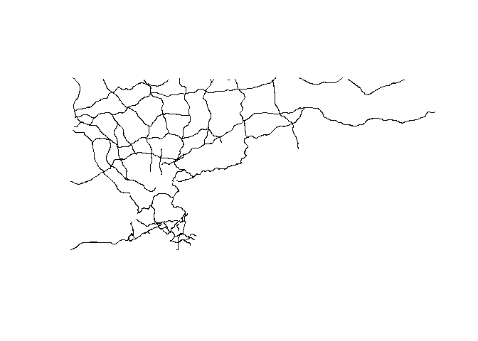
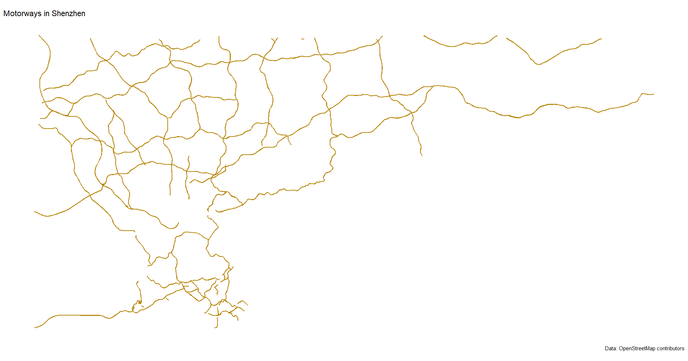
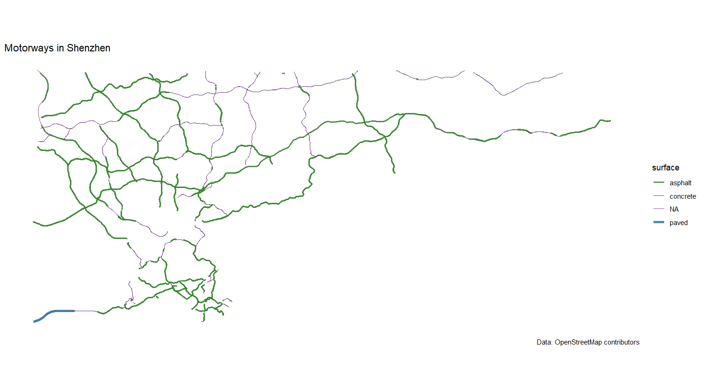
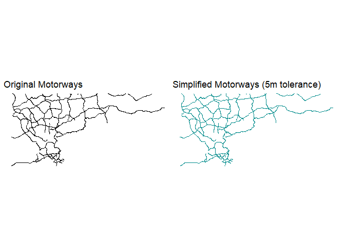
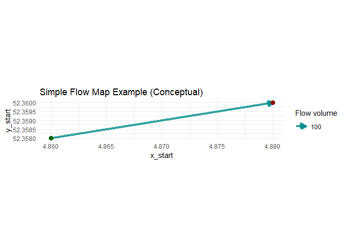
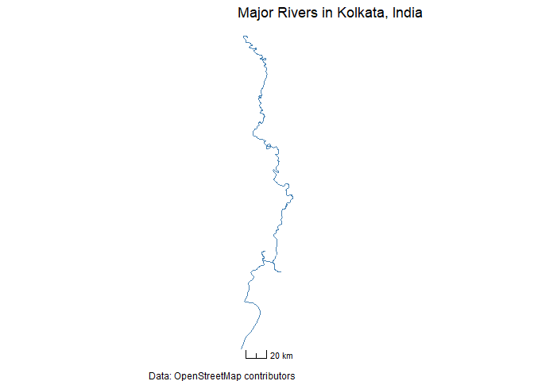

Chap06 - Line and network map
================

``` r
pacman::p_load(
    rio,            # import and export files
    here,           # locate files 
    tidyverse,      # data management and visualization
    sf,
    osmdata,
    ggspatial,
    patchwork
)
```

# Motorways in Shenzhen, China

``` r
# motorways #-------------
```

## Data

Get bounding box for Shenzhen, China

``` r
city_bbox <- osmdata::getbb("Shenzhen, China")
city_bbox
```

    ##         min       max
    ## x 113.68052 115.38906
    ## y  21.82136  23.01653

Build and run OSM query for motorways within the city

``` r
# start the query for the bounding box
osm_motorways_query1 <- osmdata::opq(bbox = city_bbox,
                                     timeout = 60)

osm_motorways_query1
```

    ## $bbox
    ## [1] "21.8213642,113.6805151,23.016534,115.3890648"
    ## 
    ## $prefix
    ## [1] "[out:xml][timeout:60];\n(\n"
    ## 
    ## $suffix
    ## [1] ");\n(._;>;);\nout body;"
    ## 
    ## $features
    ## NULL
    ## 
    ## $osm_types
    ## [1] "node"     "way"      "relation"
    ## 
    ## attr(,"class")
    ## [1] "list"           "overpass_query"

``` r
# specify tag highway=motorway
osm_motorways_query2 <- osm_motorways_query1 %>% 
    osmdata::add_osm_feature(key = "highway",
                             value = "motorway")

osm_motorways_query2
```

    ## $bbox
    ## [1] "21.8213642,113.6805151,23.016534,115.3890648"
    ## 
    ## $prefix
    ## [1] "[out:xml][timeout:60];\n(\n"
    ## 
    ## $suffix
    ## [1] ");\n(._;>;);\nout body;"
    ## 
    ## $features
    ## [1] "[\"highway\"=\"motorway\"]"
    ## 
    ## $osm_types
    ## [1] "node"     "way"      "relation"
    ## 
    ## attr(,"class")
    ## [1] "list"           "overpass_query"

``` r
# execute the query
osm_motorways_query <- osm_motorways_query2 %>% 
    osmdata::osmdata_sf()

osm_motorways_query
```

    ## Object of class 'osmdata' with:
    ##                  $bbox : 21.8213642,113.6805151,23.016534,115.3890648
    ##         $overpass_call : The call submitted to the overpass API
    ##                  $meta : metadata including timestamp and version numbers
    ##            $osm_points : 'sf' Simple Features Collection with 33215 points
    ##             $osm_lines : 'sf' Simple Features Collection with 6353 linestrings
    ##          $osm_polygons : 'sf' Simple Features Collection with 0 polygons
    ##        $osm_multilines : NULL
    ##     $osm_multipolygons : NULL

## Extract the lines object

``` r
city_motorways_sf <- osm_motorways_query$osm_lines

city_motorways_sf %>% tibble()
```

    ## # A tibble: 6,353 × 472
    ##    osm_id   name        access access_control `addr:street:en` `addr:street:zh` alt_name
    ##    <chr>    <chr>       <chr>  <chr>          <chr>            <chr>            <chr>   
    ##  1 22732384 香港仔隧道 Aber… <NA>   <NA>           <NA>             <NA>             堅拿道天橋 C…
    ##  2 23143626 東區海底隧道 Eas… <NA>   <NA>           <NA>             <NA>             <NA>    
    ##  3 23298496 香港仔隧道 Aber… <NA>   <NA>           <NA>             <NA>             <NA>    
    ##  4 23349951 將軍澳隧道 Tseu… <NA>   <NA>           <NA>             <NA>             將軍澳隧道公路…
    ##  5 23349952 將軍澳隧道公路 Ts… <NA>   <NA>           <NA>             <NA>             <NA>    
    ##  6 23358342 長青隧道 Cheun… <NA>   <NA>           <NA>             <NA>             <NA>    
    ##  7 23368089 環保大道 Wan P… <NA>   full           <NA>             <NA>             <NA>    
    ##  8 23368093 觀塘繞道 Kwun … <NA>   <NA>           <NA>             <NA>             <NA>    
    ##  9 23993375 大老山隧道 Tate… <NA>   <NA>           <NA>             <NA>             <NA>    
    ## 10 23993534 大老山公路 Tate… <NA>   <NA>           <NA>             <NA>             <NA>    
    ## # ℹ 6,343 more rows
    ## # ℹ 465 more variables: `alt_name:en` <chr>, `alt_name:yue` <chr>, `alt_name:zh` <chr>,
    ## #   `alt_name:zh-Hans` <chr>, `alt_name:zh-Hant` <chr>, bicycle <chr>, brand <chr>,
    ## #   `brand:en` <chr>, `brand:zh` <chr>, bridge <chr>, `bridge:alt_name` <chr>,
    ## #   `bridge:alt_name:en` <chr>, `bridge:alt_name:zh` <chr>, `bridge:insulation` <chr>,
    ## #   `bridge:loc_name:zh` <chr>, `bridge:name` <chr>, `bridge:name:en` <chr>,
    ## #   `bridge:name:zh` <chr>, `bridge:name:zh-Hans` <chr>, `bridge:ref` <chr>, …

## Basic plot

``` r
plot(sf::st_geometry(city_motorways_sf))
```

<!-- -->

## Styling lines

``` r
dev.off()
```

    ## null device 
    ##           1

``` r
fig1 <- ggplot() +
    geom_sf(data = city_motorways_sf,
            aes(geometry = geometry),
            color = "darkgoldenrod",
            linewidth = 0.6) +
    labs(title = "Motorways in Shenzhen",
         caption = "Data: OpenStreetMap contributors") +
    theme_minimal() +
    theme(axis.text = element_blank(),
          panel.grid = element_blank())

fig1
```

<!-- -->

``` r
city_motorways_sf %>% count(surface)
```

    ## Simple feature collection with 4 features and 2 fields
    ## Geometry type: GEOMETRY
    ## Dimension:     XY
    ## Bounding box:  xmin: 113.6527 ymin: 22.24976 xmax: 115.4351 ymax: 23.02738
    ## Geodetic CRS:  WGS 84
    ##    surface    n                       geometry
    ## 1  asphalt 4353 MULTILINESTRING ((114.1791 ...
    ## 2 concrete   49 MULTILINESTRING ((114.1855 ...
    ## 3    paved    6 LINESTRING (113.6541 22.249...
    ## 4     <NA> 1945 MULTILINESTRING ((113.7374 ...

``` r
(city_motorways_sf1 <- city_motorways_sf %>% 
    mutate(surface = replace_na(surface, "NA")) %>% 
    tibble())
```

    ## # A tibble: 6,353 × 472
    ##    osm_id   name        access access_control `addr:street:en` `addr:street:zh` alt_name
    ##    <chr>    <chr>       <chr>  <chr>          <chr>            <chr>            <chr>   
    ##  1 22732384 香港仔隧道 Aber… <NA>   <NA>           <NA>             <NA>             堅拿道天橋 C…
    ##  2 23143626 東區海底隧道 Eas… <NA>   <NA>           <NA>             <NA>             <NA>    
    ##  3 23298496 香港仔隧道 Aber… <NA>   <NA>           <NA>             <NA>             <NA>    
    ##  4 23349951 將軍澳隧道 Tseu… <NA>   <NA>           <NA>             <NA>             將軍澳隧道公路…
    ##  5 23349952 將軍澳隧道公路 Ts… <NA>   <NA>           <NA>             <NA>             <NA>    
    ##  6 23358342 長青隧道 Cheun… <NA>   <NA>           <NA>             <NA>             <NA>    
    ##  7 23368089 環保大道 Wan P… <NA>   full           <NA>             <NA>             <NA>    
    ##  8 23368093 觀塘繞道 Kwun … <NA>   <NA>           <NA>             <NA>             <NA>    
    ##  9 23993375 大老山隧道 Tate… <NA>   <NA>           <NA>             <NA>             <NA>    
    ## 10 23993534 大老山公路 Tate… <NA>   <NA>           <NA>             <NA>             <NA>    
    ## # ℹ 6,343 more rows
    ## # ℹ 465 more variables: `alt_name:en` <chr>, `alt_name:yue` <chr>, `alt_name:zh` <chr>,
    ## #   `alt_name:zh-Hans` <chr>, `alt_name:zh-Hant` <chr>, bicycle <chr>, brand <chr>,
    ## #   `brand:en` <chr>, `brand:zh` <chr>, bridge <chr>, `bridge:alt_name` <chr>,
    ## #   `bridge:alt_name:en` <chr>, `bridge:alt_name:zh` <chr>, `bridge:insulation` <chr>,
    ## #   `bridge:loc_name:zh` <chr>, `bridge:name` <chr>, `bridge:name:en` <chr>,
    ## #   `bridge:name:zh` <chr>, `bridge:name:zh-Hans` <chr>, `bridge:ref` <chr>, …

``` r
fig2 <- ggplot() +
    geom_sf(data = city_motorways_sf1,
            aes(geometry = geometry,
                color = surface,
                linewidth = surface),
            alpha = 0.8) +
    scale_color_manual(values = c("asphalt"= "#36842EFF",
                                  "concrete" = "#A60007FF",
                                  "paved" = "#23719CFF",
                                  "NA" = "#68317EFF")) +
    scale_linewidth_manual(values = c("asphalt"= 1,
                                      "concrete" = 0.5,
                                      "paved" = 1.5,
                                      "NA" = 0.1)) +
    labs(title = "Motorways in Shenzhen",
         caption = "Data: OpenStreetMap contributors") +
    theme_minimal() +
    theme(axis.text = element_blank(),
          panel.grid = element_blank())

fig2
```

<!-- -->

## Line simplification

Check current CRS

``` r
original_crs <- sf::st_crs(city_motorways_sf)
original_crs
```

    ## Coordinate Reference System:
    ##   User input: EPSG:4326 
    ##   wkt:
    ## GEOGCRS["WGS 84",
    ##     ENSEMBLE["World Geodetic System 1984 ensemble",
    ##         MEMBER["World Geodetic System 1984 (Transit)"],
    ##         MEMBER["World Geodetic System 1984 (G730)"],
    ##         MEMBER["World Geodetic System 1984 (G873)"],
    ##         MEMBER["World Geodetic System 1984 (G1150)"],
    ##         MEMBER["World Geodetic System 1984 (G1674)"],
    ##         MEMBER["World Geodetic System 1984 (G1762)"],
    ##         ELLIPSOID["WGS 84",6378137,298.257223563,
    ##             LENGTHUNIT["metre",1]],
    ##         ENSEMBLEACCURACY[2.0]],
    ##     PRIMEM["Greenwich",0,
    ##         ANGLEUNIT["degree",0.0174532925199433]],
    ##     CS[ellipsoidal,2],
    ##         AXIS["geodetic latitude (Lat)",north,
    ##             ORDER[1],
    ##             ANGLEUNIT["degree",0.0174532925199433]],
    ##         AXIS["geodetic longitude (Lon)",east,
    ##             ORDER[2],
    ##             ANGLEUNIT["degree",0.0174532925199433]],
    ##     USAGE[
    ##         SCOPE["Horizontal component of 3D system."],
    ##         AREA["World."],
    ##         BBOX[-90,-180,90,180]],
    ##     ID["EPSG",4326]]

Simplify the lines

``` r
tolerance_meters <- 5

city_motorways_sf_simplified <- sf::st_simplify(city_motorways_sf,
                                                dTolerance = tolerance_meters)
```

Plot original lines

``` r
fig_original <- ggplot() +
    geom_sf(data = city_motorways_sf,
            aes(geometry = geometry),
            linewidth = 0.5) +
    labs(title = "Original Motorways") +
    theme_void()
```

Plot original lines

``` r
fig_simplified <- ggplot() +
    geom_sf(data = city_motorways_sf_simplified,
            aes(geometry = geometry),
            linewidth = 0.5,
            color = "cyan4") +
    labs(title = "Simplified Motorways (5m tolerance)") +
    theme_void()
```

Combined plot

``` r
fig_original + fig_simplified
```

<!-- -->

# Simple flow map

``` r
# flow map #----------------
```

Define start and end points

``` r
origin_x <- 4.86 # Approx. Longitude near Vondelpark West 
origin_y <- 52.358 # Approx. Latitude 
dest_x <- 4.88 # Approx. Longitude near Vondelpark East 
dest_y <- 52.36
```

Data frame for flow segment

``` r
(flow_data <- data.frame(x_start = origin_x,
                        y_start = origin_y,
                        x_end = dest_x,
                        y_end = dest_y,
                        volume = 100 # fictional flow volume
                        ))
```

    ##   x_start y_start x_end y_end volume
    ## 1    4.86  52.358  4.88 52.36    100

Plot flow map

``` r
ggplot(data = flow_data) +
    geom_segment(aes(x = x_start,
                     y = y_start,
                     xend = x_end,
                     yend = y_end,
                     # map volume to linewidth (thickness)
                     linewidth = volume),
                 color = "cyan4",
                 alpha = 0.8,
                 # add arrowhead
                 arrow = arrow(length = unit(0.3, "cm"),type = "closed")) +
    # control how volume maps to thickness 
    scale_linewidth(# min/max thickness
                    range = c(0.5, 3),
                    name = "Flow volume" ) +
    # add points for origin/destination
    geom_point(aes(x = x_start, y = y_start),
               color = "darkgreen",
               size = 3) + 
    geom_point(aes(x = x_end, y = y_end), 
               color = "darkred",
               size = 3) +
    labs(title = "Simple Flow Map Example (Conceptual)") +
    # use coord_map() or coord_sf() if plotting on a real map background
    coord_fixed(ratio = 1.6) +
    theme_minimal()
```

<!-- -->

# River map

``` r
# river map #----------------
```

Get line data (OSM river)

``` r
(bbox <- osmdata::getbb("Kolkata, India"))
```

    ##        min      max
    ## x 88.23363 88.46108
    ## y 22.45203 22.61883

``` r
osm_rivers_query <- osmdata::opq(bbox = bbox,
                                 timeout = 120) %>% 
    # Increase timeout 
    osmdata::add_osm_feature(key = "waterway",
                             value = "river") %>% 
    osmdata::osmdata_sf() 

kolkata_rivers_sf <- osm_rivers_query$osm_lines
```

Data cleaning

``` r
kolkata_rivers_sf_clean <- kolkata_rivers_sf %>%
    dplyr::select(osm_id, name, waterway, geometry) %>%
    dplyr::filter(!sf::st_is_empty(geometry))
```

Plot river

``` r
fig_river <- ggplot() +
    geom_sf(data = kolkata_rivers_sf_clean,
            aes(geometry = geometry),
            color = "steelblue",
            linewidth = 0.4) +
    labs(title = "Major Rivers in Kolkata, India",
         caption = "Data: OpenStreetMap contributors") +
    # add scale bar
    ggspatial::annotation_scale(location = "bl",
                                width_hint = 0.4,
                                style = "ticks") +
    theme_void()

fig_river
```

<!-- -->
